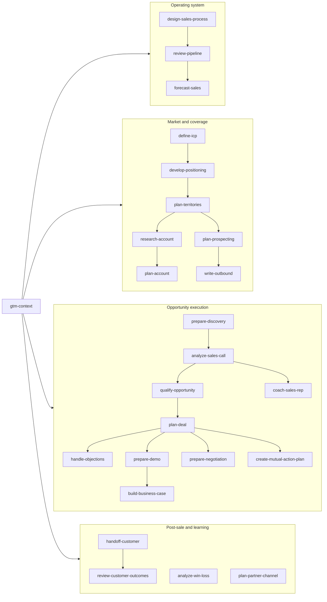

# GTM Skills for AI Agents

[](https://github.com/zarif3624/gtm-skills/actions/workflows/validate.yml)
[](https://skills.sh/zarif3624/gtm-skills)
[](LICENSE)

**25 open-source sales skills that make AI agents do real GTM work — without inventing facts, faking personalization, or producing forecasts nobody can defend.**

```bash
npx skills add zarif3624/gtm-skills
```

Built for founders, AEs, SDRs, sales engineers, product marketers, demand generation leaders, revenue enablement leaders, Customer Success teams, partner and channel leaders, and RevOps leaders. Works with skills-compatible agents like Claude Code and Codex, on your own files and CRM exports — no vendor lock-in, no platform to buy.

**→ [See what the output looks like](docs/gallery.md) · [Steal a prompt](docs/prompt-cookbook.md) · [Find your playbook](docs/playbooks/README.md) · [Ten-minute quickstart](QUICKSTART.md)**

## The Problem With AI Sales Agents

Ask a general-purpose AI to "research this account" and it will confidently hand you a funding round that never happened. Ask it to forecast and it will produce a precise number backed by nothing. That output looks like work, reads like work, and detonates the first time a buyer, a CFO, or a board member checks it.

These skills take the opposite bet: **an artifact you can defend beats an artifact that merely looks finished.**

- **Evidence-first** — facts, inferences, and unknowns stay separate. Always.
- **Buyer-aware** — workflows optimize for a sound buying decision, not pressure. A clear no is a good outcome.
- **Operational** — every skill produces an artifact a team actually uses: briefs, plans, reviews, forecasts, handoffs.
- **Composable** — one shared GTM context connects all 25 skills across the whole revenue path.
- **Tested** — every skill ships with adversarial evals designed to catch fabrication, and CI fails on drift.

## Start With Your Role

| You are | Your first week | Playbook |
| --- | --- | --- |
| Founder doing founder-led sales | Context → ICP → research → discovery → call analysis | [Founder playbook](docs/playbooks/founder.md) |
| AE carrying a quota | Research → discovery → deal loop → business case → close plan | [AE playbook](docs/playbooks/account-executive.md) |
| SDR building pipeline | Prospecting plan → account research → outbound that survives scrutiny | [SDR playbook](docs/playbooks/sdr.md) |
| Sales engineer or solutions consultant | Technical discovery → demo → objection proof → shared validation | [Sales engineer playbook](docs/playbooks/sales-engineer.md) |
| Product marketer | Customer evidence → win/loss learning → ICP → positioning → value enablement | [Product marketing playbook](docs/playbooks/product-marketing.md) |
| Demand Generation leader | ICP → approved message → audience pilot → pipeline inspection → outcome learning | [Demand Generation leader playbook](docs/playbooks/demand-generation.md) |
| Revenue Enablement leader | Call evidence → win/loss learning → enablement asset → practice → measured behavior | [Revenue Enablement leader playbook](docs/playbooks/revenue-enablement.md) |
| Frontline sales manager | Pipeline truth → forecast → deal review → developmental coaching | [Sales manager playbook](docs/playbooks/sales-manager.md) |
| RevOps or sales leader | Pipeline truth → forecast → process → territories → win/loss | [RevOps playbook](docs/playbooks/revops-leader.md) |
| Customer Success manager | Handoff → outcome baseline → renewal evidence → expansion validation | [Customer Success playbook](docs/playbooks/customer-success.md) |
| Partner or channel leader | Customer thesis → partner pilot → activation → attributed pipeline → forecast | [Partner and channel leader playbook](docs/playbooks/partner-channel.md) |

Or grab a single copy-paste prompt from the [prompt cookbook](docs/prompt-cookbook.md) — one per skill.

## The Skills

| Stage | Skill | Use it for |
| --- | --- | --- |
| Foundation | [`gtm-context`](skills/gtm-context/) | Create the shared product, market, sales-motion, and evidence context |
| Operations | [`design-sales-process`](skills/design-sales-process/) | Design buyer-state stages, evidence gates, governance, and measurement |
| Strategy | [`define-icp`](skills/define-icp/) | Define, test, and score an ideal customer profile |
| Strategy | [`develop-positioning`](skills/develop-positioning/) | Build testable positioning, message pillars, and claim-proof maps |
| Planning | [`plan-territories`](skills/plan-territories/) | Design fair, executable territories and capacity scenarios |
| Targeting | [`research-account`](skills/research-account/) | Build a sourced account brief without inventing facts |
| Account strategy | [`plan-account`](skills/plan-account/) | Connect footprint, relationships, whitespace, and investments |
| Targeting | [`plan-prospecting`](skills/plan-prospecting/) | Turn an ICP into a focused account and contact plan |
| Outreach | [`write-outbound`](skills/write-outbound/) | Write responsible, relevant multichannel outreach |
| Discovery | [`prepare-discovery`](skills/prepare-discovery/) | Prepare questions, hypotheses, and a call plan |
| Conversation | [`analyze-sales-call`](skills/analyze-sales-call/) | Extract evidence, decisions, next steps, and coaching from sales calls |
| Enablement | [`coach-sales-rep`](skills/coach-sales-rep/) | Build focused coaching experiments from observable behavior |
| Qualification | [`qualify-opportunity`](skills/qualify-opportunity/) | Assess evidence, gaps, and next validation steps |
| Deal execution | [`plan-deal`](skills/plan-deal/) | Map stakeholders, risks, strategy, and next actions |
| Deal execution | [`handle-objections`](skills/handle-objections/) | Diagnose objections and prepare honest responses |
| Deal execution | [`prepare-demo`](skills/prepare-demo/) | Design a buyer-specific demo around outcomes |
| Value engineering | [`build-business-case`](skills/build-business-case/) | Build inspectable value, cost, scenario, and break-even models |
| Deal execution | [`prepare-negotiation`](skills/prepare-negotiation/) | Plan pricing and commercial negotiations within verified authority |
| Buying process | [`create-mutual-action-plan`](skills/create-mutual-action-plan/) | Build a shared, buyer-owned decision plan |
| Management | [`review-pipeline`](skills/review-pipeline/) | Find deal risk and prioritize actions across a pipeline |
| Management | [`forecast-sales`](skills/forecast-sales/) | Produce an auditable forecast with assumptions and scenarios |
| Post-sale | [`handoff-customer`](skills/handoff-customer/) | Transfer promises, goals, risks, and context to customer success |
| Post-sale | [`review-customer-outcomes`](skills/review-customer-outcomes/) | Review value evidence, renewal readiness, and expansion hypotheses |
| Learning | [`analyze-win-loss`](skills/analyze-win-loss/) | Find decision patterns across wins, losses, and no-decisions |
| Ecosystem | [`plan-partner-channel`](skills/plan-partner-channel/) | Design and test referral, reseller, services, and co-sell motions |

## How The Skills Work Together

`gtm-context` creates `.agents/gtm-context.md`, the shared source of truth. Every other skill reads it when available and asks only for task-specific gaps.



## Why Not Just Prompt ChatGPT?

| | A raw prompt | These skills |
| --- | --- | --- |
| Account facts | Fills gaps with confident guesses | Cites sources with access dates; marks the rest **Unknown** |
| Personalization | "I noticed you're passionate about..." | Every personalized line traces to a verified fact |
| Qualification | Restates seller optimism as analysis | Separates **Verified**, **Inferred**, and **Unknown** per dimension |
| Forecasting | One precise, indefensible number | Scenarios with stated, challengeable assumptions |
| Dirty CRM data | Silently "fixes" duplicates and currencies | Surfaces every contradiction; never edits the source |
| Consistency | Different result every session | Shared context, tested behavior, adversarial evals in CI |

See the difference on real (fictional) dirty data in the [output gallery](docs/gallery.md).

## Install

Preview the available skills:

```bash
npx skills add zarif3624/gtm-skills --list
```

Install every skill:

```bash
npx skills add zarif3624/gtm-skills
```

Install selected skills:

```bash
npx skills add zarif3624/gtm-skills --skill gtm-context --skill research-account --skill prepare-discovery
```

Or clone and copy them into a project:

```bash
git clone https://github.com/zarif3624/gtm-skills.git
cp -R gtm-skills/skills/* .agents/skills/
```

Uses the open [Agent Skills specification](https://agentskills.io). Installation and behavior can vary by client and model — the [compatibility evidence matrix](docs/compatibility.md) tracks what is verified, limited, or still unknown.

## Try It

Once installed, ask naturally:

```text
Create our GTM context from the product docs in this repository.
Research Acme Corp for an enterprise discovery call. Cite every external claim.
Turn these call notes into a qualification assessment and next-step plan.
Review this CSV pipeline and show which deals need action this week.
Build a forecast with commit, best-case, and downside scenarios.
Build an inspectable buyer business case without inventing ROI inputs.
```

You can also invoke a skill directly, such as `$prepare-discovery` or `$review-pipeline`.

Start with the artifact you need; `.agents/gtm-context.md` is helpful, not required. When it is missing, each skill should use the evidence you provide, label consequential gaps, and continue. Skills accept partial information — give the agent the strongest source material you have, and the skill labels important gaps and keeps going.

## Worked Example

Use the [RelayFox fictional workspace](examples/relayfox/) to try positioning, outbound, conversation analysis, qualification, process design, pipeline review, forecasting, customer outcomes, and win/loss learning with a coherent set of safe source files. The example deliberately contains ambiguity and dirty data so you can inspect whether evidence, held claims, and unknowns survive each handoff. The [output gallery](docs/gallery.md) shows what correct results look like.

## Bring Your Own Data

- **CRM exports** — the [generic CRM handoff pack](reference-packs/generic-crm/) maps pipeline data without silently changing source records: CSV templates, lineage and status fields, a dated currency-policy template, and a matching JSON Schema. No CRM vendor required.
- **Cross-tool evidence** — the [evidence and action ledger pack](reference-packs/evidence-ledger/) keeps claims, approvals, and commitments intact as they move between agents, spreadsheets, CRMs, and internal tools.
- **Structured context** — the [structured GTM context pack](reference-packs/structured-gtm-context/) is a machine-readable companion to `.agents/gtm-context.md` with a closed JSON contract.

## Trust Standard

Every contribution should preserve these rules:

1. Never invent account facts, contacts, intent signals, quotes, budgets, timelines, or customer proof.
2. Label claims as **Verified**, **Inferred**, or **Unknown** when the distinction matters.
3. Cite external research with a direct source and access date.
4. Treat CRM stage, probability, and seller confidence as inputs, not truth.
5. Never claim legal or regulatory compliance; surface applicable consent, privacy, and outreach requirements for human review.
6. Do not use sensitive personal data or manipulative tactics.
7. Preserve buyer agency. A good outcome can be a clear no.
8. Keep proposed owners, dates, approvals, and customer actions distinct from what is confirmed or accepted.

The [evidence and status contract](docs/evidence-contract.md) defines the vocabulary and the handoff invariants behind these rules.

## Quality, Verified In CI

This is not a prompt dump. Machines and catalog UIs can read [`catalog.json`](catalog.json) for normalized skill metadata and deterministic SHA-256 package digests; [`release-manifest.json`](release-manifest.json) binds packages, evals, examples, reference packs, and reports by hash, and the validation suite fails if any generated view drifts.

Current catalog, evaluation counts, behavioral definition coverage, and current-corpus routing coverage are published in [`quality-summary.json`](quality-summary.json). Reviewed minimums and zero-regression limits live in [`quality-policy.json`](quality-policy.json), so refreshing generated counts cannot silently make a loss of passing coverage acceptable.

Run the full dependency-free quality suite with:

```bash
python3 scripts/check.py
```

After changing a skill, eval definition, result, example, or reference pack, refresh committed metadata with `python3 scripts/update_generated.py` before running the suite. The suite checks all 25 skill packages, their metadata and bundled resources, one adversarial case per skill, cross-skill journey cases, finalized behavioral and blind-routing reports, the fictional example data, and operational reference packs. See the [evaluation guide](evals/README.md) for clean-context forward testing and evidence scoring.

## Spread It

If these skills saved you a bad forecast, a burned account, or an afternoon of CRM archaeology:

- **Star the repo** — it is how other GTM people find it.
- **Share a playbook** — the [founder](docs/playbooks/founder.md), [AE](docs/playbooks/account-executive.md), [SDR](docs/playbooks/sdr.md), [sales engineer](docs/playbooks/sales-engineer.md), [product marketing](docs/playbooks/product-marketing.md), [Demand Generation leader](docs/playbooks/demand-generation.md), [Revenue Enablement leader](docs/playbooks/revenue-enablement.md), [sales manager](docs/playbooks/sales-manager.md), [Customer Success](docs/playbooks/customer-success.md), [partner and channel leader](docs/playbooks/partner-channel.md), and [RevOps](docs/playbooks/revops-leader.md) playbooks are built to be sent to a colleague as-is.
- **Show your artifact** — post what a skill produced (with your data redacted) in [Discussions](https://github.com/zarif3624/gtm-skills/discussions). Real outputs from real workflows are the best possible contribution to the compatibility evidence.

## Contributing

Contributions are welcome, especially from working sellers, founders, RevOps operators, and customer success teams. See [CONTRIBUTING.md](CONTRIBUTING.md) for the quality bar and validation steps. War stories make great eval cases: if an AI sales tool ever burned you with a fabricated fact, that failure mode belongs in the adversarial suite.

For security concerns and the project threat model, see [SECURITY.md](SECURITY.md).

Maintaining or extending the repository? Start with the [architecture and change-impact guide](docs/architecture.md).

## Roadmap

The quality foundation and first workflow expansion are in place. The next priority is to publish reproducible compatibility results across additional agents and measure whether a new user can reach a useful first artifact in under ten minutes.

See the [full product roadmap](ROADMAP.md) for priorities, measures, and deliberate non-goals. Release history and the evidence-gated publication checklist are in [CHANGELOG.md](CHANGELOG.md) and [RELEASING.md](RELEASING.md).

## License

[MIT](LICENSE). Use, adapt, and contribute back.

Built by [Zarif](https://github.com/zarif3624), creator of [Zarif Automates](https://zarifautomates.com).
