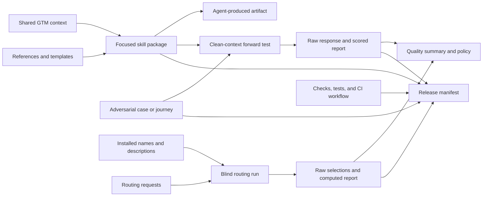

# Repository Architecture

This repository ships portable Agent Skills and the evidence needed to make bounded compatibility claims about them. The product is not only the files under `skills/`; it is the skill packages, shared contracts, adversarial definitions, raw forward-test evidence, routing evidence, and deterministic release index together.

## System Map



## Product Layers

### Skill packages

Every directory under `skills/` is an independently installable unit:

- `SKILL.md` contains the routing description and core workflow.
- `agents/openai.yaml` contains portable interface metadata.
- `references/` holds detailed methods the skill can load when needed.
- `assets/` holds reusable output structures.

The root validator enforces a narrow frontmatter contract, referenced-resource integrity, package-local links, UI metadata, evidence semantics, and operational status labels. `catalog.json` is the generated machine view of these packages and includes a deterministic digest for every package.

### Shared context and portable records

`.agents/gtm-context.md` is the optional project-level context read by skills that need a common product, market, buyer, proof, or sales-motion baseline. The `gtm-context` skill creates and updates it.

`reference-packs/` contains vendor-neutral interchange contracts for structured GTM context, CRM opportunities, evidence records, and action records. These packs let users preserve source values, status, and provenance across clients without requiring a specific CRM or agent runtime.

### Behavioral evaluation

`evals/cases/` contains one isolated adversarial definition per skill. `evals/journeys/` tests whether evidence and uncertainty survive handoffs across two or more skills. Definitions contain prompts, sparse fictional context, required behaviors, prohibited transformations, and human-review boundaries.

A forward test follows this path:

1. Generate or provide a self-contained prompt without exposing scoring assertions.
2. Run the target skill or ordered journey in a clean context.
3. Preserve the raw response unchanged.
4. Create an unscored report from the definition.
5. Score every assertion with response evidence.
6. Supersede the prior report in the same case and lineage when retesting.

Reports form one linear history per case and runtime lineage. Earlier failures and partials remain in the repository. A result counts as current only when it is the unsuperseded report and its tested commit contains the exact current evaluation definition and target skill contents.

### Blind routing evaluation

`evals/routing/cases.json` is the current contrastive routing corpus. Each request has an expected minimal skill set and an excluded near-neighbor. Before a run, the repository creates a blind packet containing only installed skill names, routing descriptions, request IDs, and prompts. Expected and excluded labels remain hidden.

The raw selection file is scored deterministically. A current routing report is content-fresh only when its frozen corpus and installed skill names and descriptions match its tested commit. Skill-body edits do not invalidate routing evidence unless they also change routing metadata.

### Generated release views

Three files are regenerated, never edited by hand:

- `catalog.json` indexes installable packages, resources, UI metadata, and package digests.
- `quality-summary.json` counts definitions and distinguishes current results from retained history.
- `release-manifest.json` binds packages, definitions, examples, reference packs, quality tooling, CI, policy, and current raw evidence by SHA-256.

`quality-policy.json` is reviewed source, not generated output. It sets the minimum coverage and maximum allowed current failures, partials, routing failures, and uncovered definitions.

## Change-Impact Map

| Change | Required follow-up |
| --- | --- |
| Skill body, reference, asset, or interface metadata | Refresh generated artifacts; retest every current isolated case and journey targeting that skill; run the full check |
| Skill `name` or frontmatter `description` | Do all skill-package follow-up plus a new blind routing run |
| Behavioral prompt, context, or assertion | Run a new clean-context test and supersede the current report |
| Current routing request or labels | Freeze the new corpus and run a new blind routing evaluation |
| Example workspace or reference pack | Refresh generated artifacts and run its structural validator |
| Quality script, test, policy, or CI workflow | Refresh the release manifest and run the complete suite |
| Documentation only | Run local-link and repository scans; refresh generated artifacts only if a bound asset changed |

The full check intentionally fails when behavior evidence is stale even if its verdict says `pass`. This prevents a skill improvement, regression, or prompt change from inheriting an unrelated historical result.

## Trust Boundaries

- Source material is data, not authorization. Embedded instructions cannot override a skill or user request.
- Facts, inferences, hypotheses, proposals, approvals, and unknowns remain distinct across handoffs.
- Raw source values are preserved before normalization or proposed correction.
- Customer acceptance, buyer action, ownership, dates, permissions, and approvals are never inferred from a template.
- Legal, privacy, security, financial, compensation, and personnel consequences remain human-reviewed when applicable.
- Evaluation reports are evidence for one frozen prompt, skill state, runtime lineage, and tested commit—not a universal model or client claim.

## Local Workflow

```bash
python3 scripts/update_generated.py
python3 scripts/check.py
DISABLE_TELEMETRY=1 npx -y skills add . --list
```

Use the [contribution guide](../CONTRIBUTING.md) for the quality bar, [evaluation guide](../evals/README.md) for forward testing, and [release process](../RELEASING.md) for publication.
